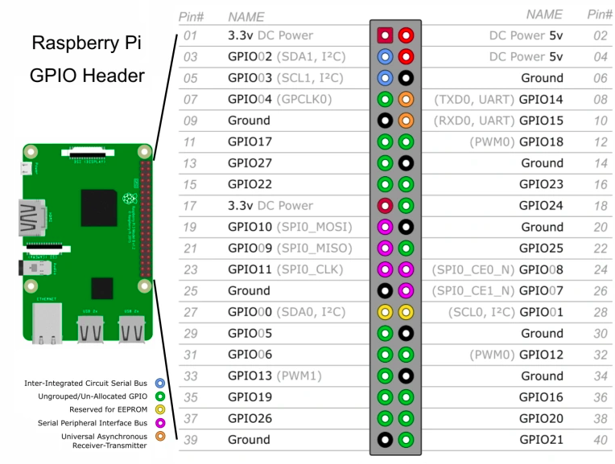

# Project-Plant

## Button

- **\+** --> Alimentation 3.3V
- **S** --> GPIO 15

## Temps/Humidity

- **\+** --> 3.3V
- **\-** --> GROUND
- **S** --> GPIO 14

## Humidity Ground (Boolean)

- **\+** --> 5V
- **\-** --> GROUND (en face GPIO 21)
- **DO** --> GPIO 20

## Rotary

- **\+** --> 3.3V (Breadboard)
- **\-** --> GROUND (Breadboard)
- **CLK** --> GPIO 17
- **DT** --> GPIO 18

